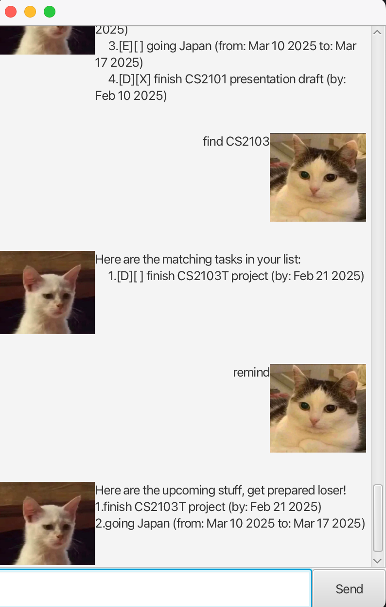

# Ozymandias User Guide




>My name is Ozymandias, King of Kings;  
>Look on my Works, ye Mighty, and despair!  
>Nothing beside remains. Round the decay   
>
> by [Percy Bysshe Shelley](https://www.poetryfoundation.org/poems/46565/ozymandias) 

## Command List
| Command                                              | Description                          |
| ---------------------------------------------------- | ------------------------------------ |
| `list`                                               | Lists all tasks                     |
| `mark <task number>`                                 | Marks a task as done                |
| `unmark <task number>`                               | Marks a task as not done            |
| `todo <task>`                                        | Adds a Todo task                    |
| `event <task> /from <date> <time> /to <date> <time>` | Adds an Event task                   |
| `deadline <task> /by <date> <time>`                  | Adds a Deadline task                |
| `delete <task number(s)>`                            | Deletes one or more tasks by number |
| `find <keyword>`                                     | Finds tasks matching keyword       |
| `remind`                                                | Display tasks with upcoming deadlines                   |
| `bye`                                                | Exit the program                  |


---
## Features:
### 1. List Existing Tasks

Usage: `list`  
Example: `list`

This command displays all your saved tasks in the following format:

```md
Here are your tasks:

1. [E][ ] project meeting (from: Mar 17 2025 2:00pm to: Mar 17 2025 6:00pm)
2. [T][X] eat fruits
3. [T][ ] finish CS2103T
4. [D][ ] CS2101 work (by: Feb 3 2025 11:59pm)
5. [D][X] project submission (by: Feb 10 2025 3:00pm)
```

---
### 2. Mark a Task as completed

Usage: `mark <task number>`

Example: `mark 2`

This marks the specified task as complete and display [X] in their status.

```md
2. [T][X] eat fruits
```
---
### 3. Unark a Task as not completed

Usage: `unmark <task number>`

Example: `unmark 2`

This marks the specified task as not completed and display [ ] in their status.

```md
2. [T][ ] eat fruits
```
---
### 4. Delete task

Usage: `delete <task number 1>`

Example: `delete 2`

You can delete one or multiple tasks by specifying their numbers. The task list will automatically adjust.

```md
Fine, I've removed this task:
[T][X] eat fruits
Now you have 4 tasks in the list.
```

---

### 5. Add a Todo Task

Usage: `todo <task>`

Example: `todo eat fruits`

Adds a Todo task to your list. Todos are simple tasks without deadlines or time constraints. Your tasks list will now include the new Todo:

```md
Fine, I'll add this task:
 [T][ ] eat fruits
Now you have 5 tasks on the list.   
```

---

### 6. Add an Event Task

Usage: `event <task> /from <date> <time> /to <date> <time>`

Example: `event project presentation /from 2025-03-10 /to 2025-03-11`

Adds an Event to your task list, specifying a start and end date and time.

Here are your tasks:

```md
Fine, I'll add this task:
 [D][ ] project submission (from: Mar 10 2025 to: Mar 11 2025)
Now you have 6 tasks on the list.
```

---

### 7. Add a Deadline Task

Usage: `deadline <task> /by <date> <time>`

Example: `deadline assignment /by 2025-02-01`

Adds a Deadline task to your list with a specific due date and time.

```md
Fine, I'll add this task:
[D][ ] assignment (by: Feb 21 2025)
Now you have 7 tasks on the list.
```

### 8. Find task(s)

Usage: `find <keyword>`

Example: `find a`

Search for tasks containing the given letters and lists the results

```md
Here are your tasks:

1. [D][ ] assignment (by: Feb 21 2025)
```

### 9. Remind

Usage: `remind`   

Example: `remind`  

Reminds you of upcoming deadlines and events

```md
Here are the upcoming stuff, get ready, loser!

1. [D][ ] assignment (by: Feb 3 2025 11:59pm)
2. [D][ ] assignment 3 (by: Feb 21 2025 11:59pm)
```
---

### 9. Exit the Program

Usage: `bye`

Simply exits the program, shortly after giving a goodbye message. Alternatively, you can close the window normally in Windows/macOS/Linux by clicking the 'X' manually.

Note that user progress is saved after every command automatically. If there is an error, the program will inform the user immediately.

```md
Go now, traveler
